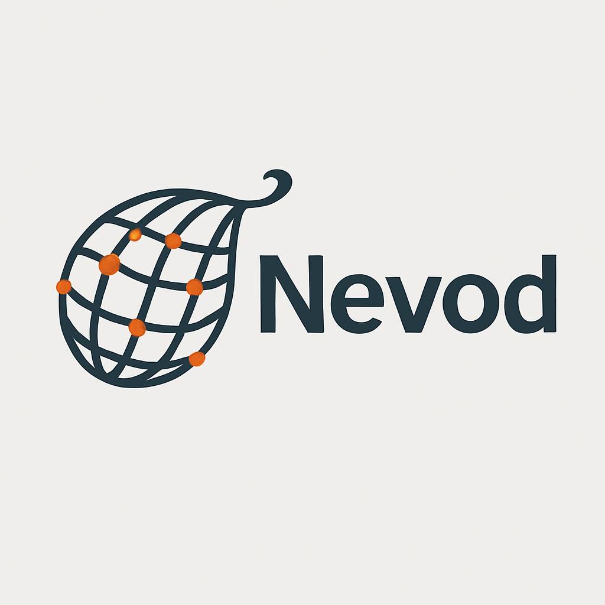

# Nevod

<p align="center">
  
</p>

<p align="center">
  <a href="https://swift.org">
    
  </a>
  <a href="https://swift.org/package-manager/">
    
  </a>
  
  <a href="LICENSE">
    
  </a>
</p>

<p align="center">
  <b>Modern, lightweight and flexible networking layer for Swift</b>
</p>

<p align="center">
  <a href="README-ru.md">Русская версия</a>
</p>

## Overview

Nevod is a Swift networking library designed with simplicity and flexibility in mind. Built on modern Swift concurrency (async/await) and actor-based architecture for thread-safety.

## Key Features

- **Simple API** - Minimal boilerplate for basic requests
- **Interceptor Pattern** - Flexible middleware for request adaptation and retry logic
- **Multiple Authentication Methods** - Bearer tokens, Cookies, API keys (header & query)
- **Generic Token System** - Type-safe authentication with any token type
- **Auto Token Refresh** - Built-in OAuth support with custom refresh strategies
- **Multiple Services** - Easy management of different API endpoints
- **Type-Safe** - Protocol-oriented design with full type safety
- **Modern Swift** - async/await and actor-based concurrency
- **Logging** - Integrated request/response logging via OSLog

## Quick Start

```swift
import Nevod

// 1. Define service domain
enum MyDomain: ServiceDomain {
    case api
    var identifier: String { "api" }
}

// 2. Configure
let config = NetworkConfig(
    environments: [
        MyDomain.api: SimpleEnvironment(
            baseURL: URL(string: "https://api.example.com")!
        )
    ]
)

// 3. Create provider
let provider = NetworkProvider(config: config)

// 4. Make request
let route = SimpleGetRoute<User, MyDomain>(
    endpoint: "/users/me",
    domain: .api
)

let user = try await provider.perform(route)
```

## Installation

**Swift Package Manager:**

```swift
dependencies: [
    .package(url: "https://github.com/andrey-torlopov/Nevod.git", from: "0.0.4")
]
```

See [Installation Guide](./Docs/en/Installation.md) for details.

## Documentation

- **[Quick Start Guide](./Docs/en/QuickStart.md)** - Get started in minutes
- **[Authentication Guide](./Docs/en/Authentication.md)** - Bearer, Cookie, API Key auth
- **[Installation](./Docs/en/Installation.md)** - Setup and dependencies

## Authentication Example

```swift
// Bearer Token
let storage = TokenStorage<Token>(storage: keychain)
let authInterceptor = AuthenticationInterceptor(
    tokenStorage: storage,
    refreshStrategy: { oldToken in
        let newToken = try await refreshToken(oldToken?.value)
        return Token(value: newToken)
    }
)

let provider = NetworkProvider(config: config, interceptor: authInterceptor)
```

## Built-in Token Types

- `Token` - Bearer token (Authorization header)
- `CookieToken` - Session-based authentication
- `APIKeyToken` - API key in custom header
- `QueryAPIKeyToken` - API key as URL parameter

## Requirements

- iOS 17.0+ / macOS 15.0+
- Swift 6.2+
- Xcode 16.0+

## Dependencies

- [Letopis](https://github.com/andrey-torlopov/Letopis) - Structured logging

## License

MIT License - see [LICENSE](./LICENSE) file for details

## Contributing

Contributions are welcome! Please feel free to submit a Pull Request.
